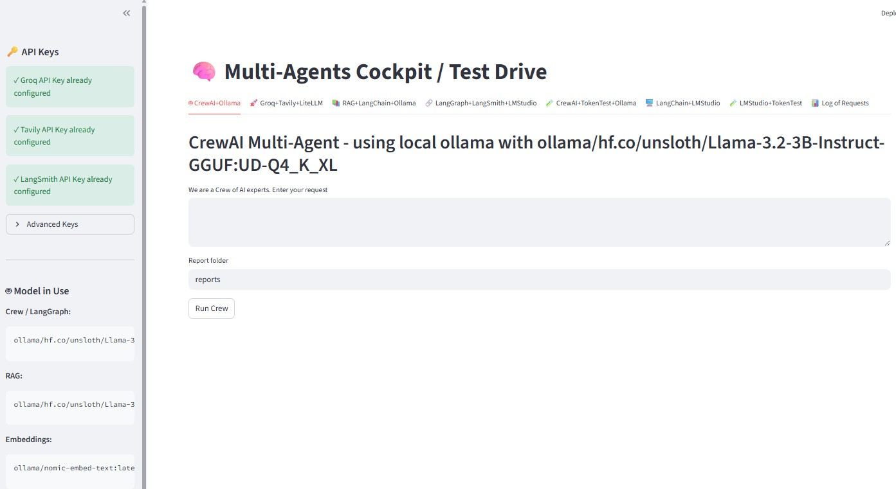
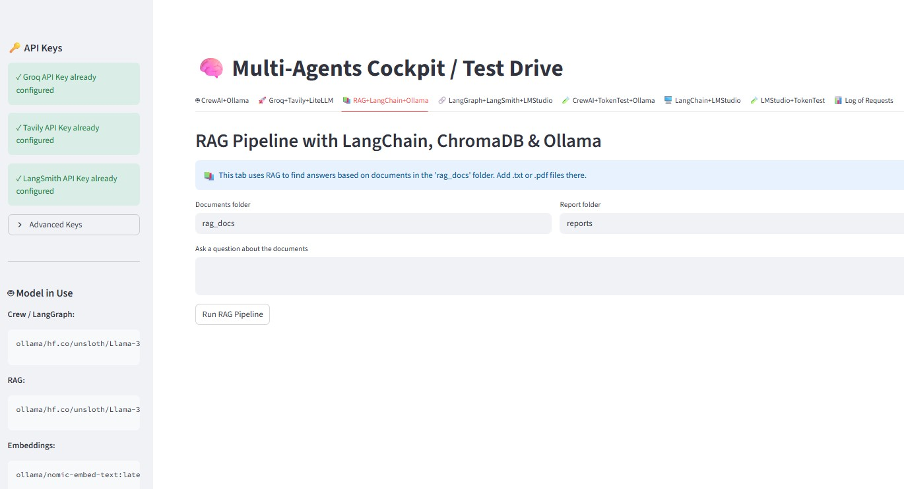
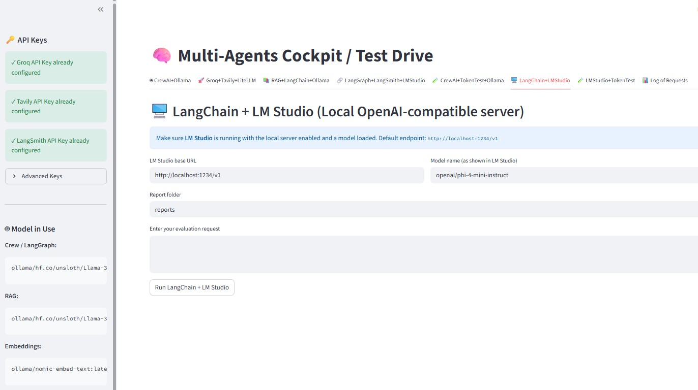
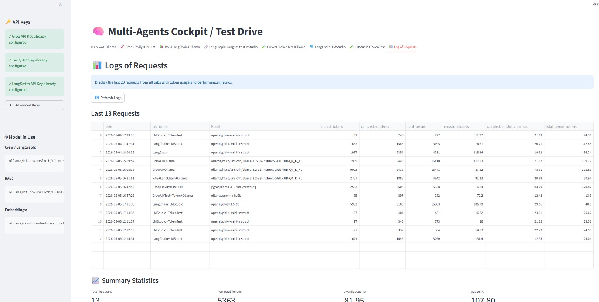

# Multi-Agents Cockpit (v1.3.3)

## Introduction

**Multi-Agents Cockpit** is a comprehensive Streamlit-based application that serves as a testing and evaluation platform for multiple AI agent frameworks and Large Language Models (LLMs). It provides an interactive dashboard with 8 specialized tabs, each demonstrating different approaches to building and orchestrating AI agents with various LLM backends, plus a dedicated monitoring dashboard.

The application supports multiple agent frameworks (CrewAI, LangGraph) and LLM servers (Ollama, Groq, LM Studio, OpenAI), all with free api keys for small projects, allowing developers to:
- Compare different agent orchestration approaches, also with one on-line (Groq)
- Evaluate LLM performance metrics (tokens, latency, throughput)
- Build agentic workflows for report generation and RAG (Retrieval-Augmented Generation)
- Analyze token usage patterns across different models
- Generate PDF reports from workflow outputs

---

## Motivation for this project

**Learning**, we are always learning.

And, to answer two questions:

- **And if we have a "digital blackout", Amazon, Microsoft or Google clouds fail, or an attack on Cloudfare, is it possible to have a contingency or to have a local, low-cost alternative to agent servers and small applications from the outset?**
- **Is it possible to have a local development environment, with local LLM, without the need for an internet connection, to develop and test systems with agents and save N hours of servers in the cloud?**

**The answer to both questions is yes.**

The project below, or project draft, because the result is the basics of the basics for testing and analyzing various tools, frameworks, and LLMs.

An "entry level" gaming notebook with Intel i5 11300H CPU, 32 GB RAM, Nvidia GTX 1650 with 4GB VRAM was used. And everything worked with limitation in the LLMs (number of parameters of the LLMs at 3B and 4B). If the machine had an Nvidia RTX xx90 and 128 or 256 GB of RAM, the possibility of other tests and analyses would be drastically greater.

**One last tip:** to optimize an LLM model, it is essential to pay attention to several parameters that both Ollama (Modelfile) and LM Studio provide to fine-tune. And they change from model to model and for the hardware they use (VRAM size, CPU cores/threads, etc.), example of these parameters: Context 4000, GPU Offload (Layers) 32, evaluation batch size 256, CPU Thread Pool Size 4, temperature 0.7, top K 20, repeat penalty 1, top P 0.95, min P 0.05, K cache quantization Q8_0.

Observation: The focus of this project is to analise LLM behaviour in a local environment and not the quality of prompts, which I used the minimum and all were with a profile of an "AI expert" or similar.

Finally, I would like to thank the following assistants: Claude Haiku 4.5, Claude Sonnet 4.6, GPT-5.3-Codex, Grok Code Fast 1, and VS Code for the great IDE with Copilot PRO.

**This Project is FREE to any person to work with the Software without restriction, including without limitation the rights to use, copy, modify, merge, publish, distribute.**

---



at the end of README you will find more images.

## Project Structure

```
multi_agentsV1/
├── README.md                          # This file - complete project documentation
├── pyproject.toml                     # Project metadata and dependencies (UV/pip)
├── uv.lock                            # Dependency lock file for reproducible builds
├── multi_agentsV1.3.3.py             # Main Streamlit application entry point with all 8 tabs
│
├── Tab Modules (Agentic Workflows & Agents)
├── tab_crewai.py                      # Tab 1: CrewAI multi-agent orchestration framework
├── tab_groq.py                        # Tab 2: Groq + Tavily web search (no CrewAI)
├── tab_rag.py                         # Tab 3: RAG with LangChain + ChromaDB + Ollama
├── tab_langgraph.py                   # Tab 4: LangGraph stateful workflow graph + LangSmith
├── tab_crewTokenTest.py               # Tab 5: Token tracking for CrewAI agents
├── tab_LMstudio_Lchain.py             # Tab 6: LangChain pipeline with LM Studio backend
├── tab_LMStudioTokenTest.py           # Tab 7: Token tracking for LM Studio via LangChain
│
├── Utility & Helper Modules
├── logging_functions.py               # Request logging (ensure_logs_folder, log_request, read_logs)
├── pdf_generator.py                   # PDF report generation (ReportLab formatting)
│
├── Data & Configuration Directories
├── rag_docs/                          # User-provided documents for RAG pipelines (*.txt, *.pdf)
├── reports/                           # Generated PDF reports output directory
├── logs/                              # Application metrics and logs
│   └── request_logs.csv               # Timestamped log of all requests with token/performance data
│
├── Vector Database & Cache (Auto-Managed)
├── .chroma_db/                        # ChromaDB persistent vector storage for RAG embeddings
│
├── Python Virtual Environment
└── .venv/                             # Python 3.11+ isolated virtual environment
```

### Key Files Map

| File/Directory | Purpose | Used By |
|---|---|---|
| [multi_agentsV1.3.3.py](multi_agentsV1.3.3.py) | Main app entry point with 8 tabs | All tabs |
| [tab_crewai.py](tab_crewai.py) | Multi-agent orchestration | Tab 1 |
| [tab_groq.py](tab_groq.py) | Direct LLM + web search | Tab 2 |
| [tab_rag.py](tab_rag.py) | Knowledge base retrieval | Tab 3 |
| [tab_langgraph.py](tab_langgraph.py) | Stateful workflows | Tab 4 |
| [tab_crewTokenTest.py](tab_crewTokenTest.py) | Token metrics (CrewAI) | Tab 5 |
| [tab_LMstudio_Lchain.py](tab_LMstudio_Lchain.py) | Local LLM pipeline | Tab 6 |
| [tab_LMStudioTokenTest.py](tab_LMStudioTokenTest.py) | Token metrics (LM Studio) | Tab 7 |
| [logging_functions.py](logging_functions.py) | CSV logging for all tabs | Tabs 1-7, 8 |
| [pdf_generator.py](pdf_generator.py) | PDF export | Tabs 1, 3, 4, 6 |
| `rag_docs/` | Document storage | Tab 3 |
| `reports/` | PDF output | Tabs 1, 3, 4, 6 |
| `logs/request_logs.csv` | Metrics dashboard | Tab 8 |

---

## Tab Modules Overview

### **Tab 1: CrewAI - Crew Builder**
**File:** [tab_crewai.py](tab_crewai.py)

**Purpose:** Demonstrates multi-agent orchestration using the CrewAI framework.

**Components:**
- **Selector Agent** – Identifies the top 5 ML/DL topics matching user input
- **Explainer Agent** – Provides detailed explanations with examples
- **Reporter Agent** – Structures findings into a formal report

**Key Features:**
- Token usage tracking via LLM hooks
- Pydantic models for structured output validation
- Async agent coordination
- Verbose logging of agent interactions

**Output:** Structured report with title and sections containing ML algorithm evaluations

---

### **Tab 2: Groq + Tavily Web Search**
**File:** [tab_groq.py](tab_groq.py)

**Purpose:** Direct LLM invocation with web search integration (no CrewAI overhead).

**Components:**
- **Tavily Client** – Web search API for current information
- **Groq LLM** – High-speed language model via LiteLLM
- **Direct Completion** – Low-latency API calls with fail-fast strategy

**Key Features:**
- The only on-line tab (using Groq and Tavely)
- Real-time web search context integration
- Reduced latency compared to multi-agent workflows
- Simple prompt-response pattern
- Token tracking and performance metrics

**Output:** JSON-formatted topics with reasoning, enriched with web search context

---

### **Tab 3: RAG (Retrieval-Augmented Generation)**
**File:** [tab_rag.py](tab_rag.py)

**Purpose:** Build knowledge bases from documents and retrieve contextual information for LLM queries.

**Components:**
- **Document Loaders** – Support for TXT, PDF, and other formats
- **ChromaDB** – Vector database for semantic search
- **OllamaEmbeddings** – Local embedding generation
- **LangSmith Integration** – Tracing and debugging RAG pipelines
- **LangChain Pipeline** – Document processing and retrieval chain

**Key Features:**
- Load documents from `rag_docs/` folder
- Automatic collection cleanup (keeps latest 3 collections)
- Semantic search with embedding similarity
- Local execution (no external embedding API required)
- Comprehensive audit trail via LangSmith

**Workflow:**
1. Load documents from `rag_docs/` folder
2. Split documents into chunks
3. Generate embeddings and store in ChromaDB
4. Answer user questions by retrieving relevant context
5. Pass context + question to LLM for final answer

**Output:** Answer with source references and retrieval metadata

---

### **Tab 4: LangGraph + LangSmith**
**File:** [tab_langgraph.py](tab_langgraph.py)

**Purpose:** Build stateful, multi-step agentic workflows with cycles using graph-based architecture.

**Components:**
- **WorkflowState** – TypedDict maintaining state across workflow execution
- **Selector Node** – Topic selection and ranking
- **Explainer Node** – Detailed explanations with examples
- **Formatter Node** – JSON report generation
- **LangGraph StateGraph** – DAG-based workflow orchestration

**Key Features:**
- Stateful workflow management across multiple steps
- Support for cycles and conditional edges
- Per-step token usage tracking
- LangSmith tracing for debugging and monitoring
- Markdown code fence handling for robust parsing

**Workflow:**
1. Start with user input and selected metrics
2. Route through selector → explainer → formatter nodes
3. Accumulate state and token usage metrics
4. Return structured report with full execution trace

**Output:** Comprehensive report with step-by-step token usage breakdown

---

### **Tab 5: CrewAI Token Tracking**
**File:** [tab_crewTokenTest.py](tab_crewTokenTest.py)

**Purpose:** Isolated token usage analysis for CrewAI workflows.

**Components:**
- **Single Research Task** – Researcher agent summarizes AI trends
- **LLM Hook Registration** – Captures token metrics per LLM call
- **Performance Metrics** – Tokens-per-second calculations

**Key Features:**
- Detailed token statistics from CrewAI's `result.token_usage`
- Elapsed time and throughput analysis
- Per-agent call tracking

**Output:**
```json
{
  "per_call": [{"agent": "...", "iteration": N}],
  "totals": {
    "prompt_tokens": X,
    "completion_tokens": Y,
    "total_tokens": Z,
    "cached_prompt_tokens": 0,
    "successful_requests": 1
  },
  "performance": {
    "elapsed_seconds": T,
    "completion_tokens_per_sec": C,
    "total_tokens_per_sec": Z
  }
}
```

---

### **Tab 6: LM Studio + LangChain**
**File:** [tab_LMstudio_Lchain.py](tab_LMstudio_Lchain.py)

**Purpose:** Run local LLM inference via LM Studio using LangChain integration.

**Components:**
- **LM Studio Server** – OpenAI-compatible REST API at `http://localhost:1234/v1`
- **LangChain ChatOpenAI** – Client wrapper for local LLM
- **Three-Agent Pipeline:**
  - Selector – Topic selection
  - Explainer – Detailed explanations
  - Formatter – Report generation

**Key Features:**
- Completely local LLM execution (privacy-friendly)
- OpenAI API compatibility
- Per-step token and latency tracking
- Configurable temperature and retry behavior

**Requirements:**
- LM Studio installed and running locally
- Model loaded in LM Studio (e.g., Llama 3.2 3B, Phi 4 Mini, Gemma)

**Output:** Same structured report format as other agents, with local execution transparency

---

### **Tab 7: LM Studio Token Test**
**File:** [tab_LMStudioTokenTest.py](tab_LMStudioTokenTest.py)

**Purpose:** Simplified token tracking for local LM Studio models.

**Components:**
- **Single Task** – AI trends summarization via local LLM
- **LangChain Integration** – Direct message invocation
- **Usage Metadata** – Token counts from LM Studio response

**Key Features:**
- Minimal overhead for baseline performance measurement
- Direct comparison with Tab 5 (CrewAI token test)
- Same output format for cross-comparison

**Output:** Token summary with elapsed time and throughput metrics (matching Tab 5 format)

---

### **Tab 8: Log of Requests**
**File:** Built into [multi_agentsV1.3.3.py](multi_agentsV1.3.3.py) (no separate module)

**Purpose:** View and analyze performance metrics from all previous requests across all tabs.

**Components:**
- **Log Reader** – Retrieves CSV log data
- **Summary Statistics** – Aggregated metrics across all requests
- **Visualization Charts** – Token usage and performance trends
- **Export Functionality** – Download logs as CSV

**Key Features:**
- Displays last 20 requests with full metadata
- Real-time refresh button to update logs
- Summary statistics including:
  - Total number of requests
  - Average tokens per request
  - Average elapsed time
  - Average throughput (tokens/second)
- Breakdown charts:
  - Requests by Tab (bar chart)
  - Token usage trends (line chart: prompt, completion, total)
  - Performance trends (line chart: elapsed time, throughput)
- CSV export with timestamp for external analysis

**Workflow:**
1. All tabs automatically log their results to `logs/request_logs.csv`
2. Tab 8 reads and parses the CSV file
3. Displays tabular data with pagination
4. Shows visual trends and summary statistics
5. Allows download of logs for further analysis

**Output:** Interactive dashboard with:
- Full request table (date, tab_name, model, tokens, elapsed_seconds, throughput)
- Summary metrics cards
- Bar chart of request distribution by tab
- Line charts for token and performance trends
- CSV export file

---

## Utility Modules

### **Logging Functions**
**File:** [logging_functions.py](logging_functions.py)

**Key Functions:**
- `ensure_logs_folder()` – Creates `logs/` directory if missing
- `log_request(tab_name, model, token_summary)` – Writes metrics to CSV
- `read_logs(limit)` – Retrieves last N log entries as DataFrame

**Output Location:** `logs/request_logs.csv`

**CSV Columns:**
- `date` – ISO timestamp
- `tab_name` – Tab module name
- `Model` – LLM model identifier
- `prompt_tokens` – Input tokens
- `completion_tokens` – Output tokens
- `total_tokens` – Sum of input + output
- `elapsed_seconds` – Wall-clock time
- `completion_tokens_per_sec` – Throughput
- `total_tokens_per_sec` – Total throughput

---

### **PDF Generator**
**File:** [pdf_generator.py](pdf_generator.py)

**Key Functions:**
- `format_text_for_streamlit(text)` – Markdown formatting for Streamlit display
- `format_text_for_pdf(text)` – ReportLab-compatible formatting
- `clean_latex_formula(text)` – Converts LaTeX math to readable plain text
- `extract_and_convert_tables(text)` – Converts Markdown tables for PDF embedding
- `save_report_pdf(report, filename)` – Generates PDF with ReportLab

**Features:**
- LaTeX formula cleaning (preserves currency symbols)
- Markdown table to PDF table conversion
- Syntax highlighting preservation
- Automatic report naming with timestamps

**Output Location:** `reports/` directory

---

## Environment Setup

### **Python Requirements**
- **Python Version:** 3.11 or later
- **Environment Manager:** UV (recommended) or pip

### **Virtual Environment Setup**

#### Using UV (Recommended):
```bash
cd d:\multi_agentsV1
uv sync
uv venv
```

#### Using pip:
```bash
cd d:\multi_agentsV1
python -m venv .venv
.venv\Scripts\activate  # On Windows
source .venv/bin/activate  # On Linux/Mac
pip install -r requirements.txt
```

### **Running the Application**

#### Using UV:
```bash
uv run streamlit run multi_agentsV1.3.3.py
```

#### Using Python directly (must activate venv first):
```bash
.venv\Scripts\activate
streamlit run multi_agentsV1.3.3.py
```

#### Using full Python path (recommended if PATH issues):
```bash
d:\multi_agentsV1\.venv\Scripts\python.exe -m streamlit run multi_agentsV1.3.3.py
```

---

## Libraries & Dependencies

### **Core Frameworks**
| Library | Version | Purpose |
|---------|---------|---------|
| `streamlit` | Latest | Web UI framework |
| `crewai[litellm]` | Latest | Multi-agent orchestration |
| `langgraph` | ≥1.1.6 | Stateful workflow graphs |
| `langchain-core` | Latest | LLM abstractions |
| `langchain-community` | Latest | Document loaders, vectorstores |

### **LLM & Embedding Models**
| Library | Version | Purpose |
|---------|---------|---------|
| `litellm` | ≥1.83.0 | LLM provider abstraction |
| `langchain-ollama` | 1.1.0 | Ollama integration |
| `langchain-openai` | ≥1.2.1 | OpenAI API client |
| `ollama` | 0.6.1 | Ollama Python client |
| `openai` | ≥2.30.0 | OpenAI SDK |

### **Vector Database & Search**
| Library | Version | Purpose |
|---------|---------|---------|
| `chromadb` | Latest | Vector database |
| `tavily-python` | Latest | Web search API |

### **Document Processing**
| Library | Version | Purpose |
|---------|---------|---------|
| `pypdf` | ≥6.10.2 | PDF parsing |
| `langchain-text-splitters` | Latest | Text chunking |

### **Monitoring & Debugging**
| Library | Version | Purpose |
|---------|---------|---------|
| `langsmith` | Latest | LLM observability & tracing |

### **Report Generation**
| Library | Version | Purpose |
|---------|---------|---------|
| `reportlab` | Latest | PDF generation |
| `pandas` | (implicit) | Data manipulation |

### **Utilities**
| Library | Version | Purpose |
|---------|---------|---------|
| `crewai-tools` | Latest | Built-in CrewAI tools |

---

## LLM Servers & Models

### **1. Ollama (Local, Default)**
**Endpoint:** `http://localhost:11434`

**Supported Models (Configured):**
- Primary: `ollama/hf.co/unsloth/Llama-3.2-3B-Instruct-GGUF:UD-Q4_K_XL`
- Alternatives (commented in config):
  - `ollama/qwen35_2b_q4_mario:latest`
  - `ollama/ExpedientFalcon/Qwen3-4B-UD-Q5_K_XL:latest`
  - `ollama/gemma4:e2b`
  - `ollama/Phi4-mini_mario:latest`
  - `ollama/hf.co/unsloth/Phi-4-mini-instruct-GGUF:Q4_K_M`

**Embedding Model:** `ollama/nomic-embed-text:latest`

**Configuration (in [multi_agentsV1.3.3.py](multi_agentsV1.3.3.py)):**
```python
OLLAMA_BASE_URL = "http://localhost:11434"
CREW_OLLAMA_MODEL = "ollama/hf.co/unsloth/Llama-3.2-3B-Instruct-GGUF:UD-Q4_K_XL"
RAG_OLLAMA_MODEL = "ollama/hf.co/unsloth/Llama-3.2-3B-Instruct-GGUF:UD-Q4_K_XL"
OLLAMA_EMBED_MODEL = "ollama/nomic-embed-text:latest"
```

**Setup Instructions:**
1. Download and install [Ollama](https://ollama.ai) from ollama.ai
(or install Docker Desktop and use a docker container - which was my choice)
2. Pull models: `ollama pull llama3.2:3b && ollama pull nomic-embed-text`
3. Start Ollama: `ollama serve` (runs on port 11434 by default) - or start it using Docker Desktop
4. (Optional) I also used Ollaman to manage and customize LLMs (Modelfile)

---

### **2. LM Studio (Local, OpenAI-Compatible)**
**Endpoint:** `http://localhost:1234/v1`

**Supported Models (Configured):**
- Primary: `openai/phi-4-mini-instruct`
- Alternatives (commented in config):
  - `openai/llama-3.2-3b-instruct`
  - `openai/google/gemma-4-e2b`
  - `openai/qwen3.5-2b`
  - `openai/qwen2.5-coder-7b-instruct`
  - `openai/qwen/qwen3-4b-thinking-2507`

**Configuration (in [multi_agentsV1.3.3.py](multi_agentsV1.3.3.py)):**
```python
LMSTUDIO_BASE_URL = "http://localhost:1234/v1"
LMSTUDIO_MODEL = "openai/phi-4-mini-instruct"
```

**Setup Instructions:**
1. Download and install [LM Studio](https://lmstudio.ai)
2. Load a model in LM Studio UI
3. Start the local server (LM Studio UI → Server tab)
4. Verify connectivity: `curl http://localhost:1234/v1/models`

---

### **3. Groq (Cloud-Based, Fast)**
**Endpoint:** Groq Cloud API

**Models Supported:**
- Various Groq-optimized models (requires API key)

**Setup Instructions:**
1. Create account at [console.groq.com](https://console.groq.com)
2. Generate API key
3. Provide API key via Streamlit sidebar in Tab 2

**Note:** Requires internet connectivity and active Groq subscription

---

### **4. OpenAI (Cloud-Based, Reference)**
**Endpoint:** OpenAI API

**Models:** GPT-4, GPT-3.5-turbo, etc.

**Setup Instructions:**
1. Create account at [platform.openai.com](https://platform.openai.com)
2. Generate API key
3. Configure in application if used

---

## Performance Monitoring

### **Token Usage Tracking**
All tabs automatically track and log:
- **Input (Prompt) Tokens** – Tokens in user input + context
- **Output (Completion) Tokens** – Tokens generated by LLM
- **Total Tokens** – Sum of input + output
- **Elapsed Time** – Wall-clock execution time
- **Throughput Metrics:**
  - Completion tokens/second (C-TPS)
  - Total tokens/second (T-TPS)

### **Logs Location**
`logs/request_logs.csv` – Complete history of all requests with metrics

### **Analyzing Performance**
```python
import pandas as pd
logs = pd.read_csv("logs/request_logs.csv")
print(logs.groupby("Model")[["total_tokens", "elapsed_seconds"]].mean())
```

---

## Key Configuration Constants

**Main Configuration File:** [multi_agentsV1.3.3.py](multi_agentsV1.3.3.py)

```python
# Ollama Settings
OLLAMA_BASE_URL = "http://localhost:11434"
CREW_OLLAMA_MODEL = "ollama/hf.co/unsloth/Llama-3.2-3B-Instruct-GGUF:UD-Q4_K_XL"

# LM Studio Settings
LMSTUDIO_BASE_URL = "http://localhost:1234/v1"
LMSTUDIO_MODEL = "openai/phi-4-mini-instruct"

# LiteLLM Settings
litellm.num_retries = 0
litellm.request_timeout = 20
```

**To switch models:**
1. Edit the `*_MODEL` variables in [multi_agentsV1.3.3.py](multi_agentsV1.3.3.py)
2. Ensure model is loaded in corresponding LLM server
3. Restart Streamlit app

---

## Common Workflows

### **Workflow 1: Compare Token Usage Across Models**
1. Open Tab 5 (CrewAI Token Test)
2. Run test with Ollama model
3. Switch to Tab 7 (LM Studio Token Test)
4. Run test with LM Studio model
5. Check `logs/request_logs.csv` to compare metrics

### **Workflow 2: Build a Knowledge Base**
1. Place documents (`.txt`, `.pdf`) in `rag_docs/` folder
2. Open Tab 3 (RAG)
3. Click "Load Documents" button
4. Ask questions about the documents

### **Workflow 3: Generate PDF Reports**
1. Run any workflow (Tabs 1, 2, 4, 6)
2. Results appear in Streamlit UI
3. Click "Download PDF Report" button
4. PDF saved to `reports/` folder

---

## Troubleshooting

| Issue | Solution |
|-------|----------|
| "Ollama connection refused" | Ensure Ollama is running: `ollama serve` |
| "LM Studio not found" | Start LM Studio UI and verify server is running on port 1234 |
| "Model not found" | Ensure model is pulled/loaded: `ollama pull model_name` |
| "Token usage unavailable" | Check LLM response includes `usage_metadata` |
| "PDF generation fails" | Ensure `reports/` folder exists (auto-created on first run) |
| "ChromaDB errors" | Safe to delete `.chroma_db/` folder – it will rebuild on next RAG tab use |
| "Streamlit not found" | Activate venv: `.venv\Scripts\activate` (Windows) |

---

## Future Enhancements

- [ ] Support for additional LLM backends (Anthropic Claude, Mistral)
- [ ] Real-time performance dashboard
- [ ] Multi-document RAG comparison
- [ ] Workflow templates for common use cases
- [ ] Export/import workflow configurations
- [ ] Advanced metrics visualization (latency distribution, cost analysis)

---

## License & Credits

**Project:** Multi-Agents Cockpit v1.3.3  
**Type:** Agentic AI Research & Evaluation Platform  
**Built with:** Streamlit, CrewAI, LangChain, LangGraph

---

## Quick Start Checklist

- [ ] Clone/download project
- [ ] Create virtual environment: `python -m venv .venv`
- [ ] Activate environment: `.venv\Scripts\activate` (Windows)
- [ ] Install dependencies: `pip install -e .`
- [ ] Start Ollama server: `ollama serve` (in another terminal - or use Docker Desktop)
- [ ] Start Ollaman (optional - to manage and customize LLMs)
- [ ] Or start LM Studio server (alternative to Ollama)
- [ ] Run app: `streamlit run multi_agentsV1.3.3.py`
- [ ] Open browser to: `http://localhost:8501`
- [ ] Select a tab and start experimenting!

---

**Happy agent building! 🤖**

some more images from the project.







